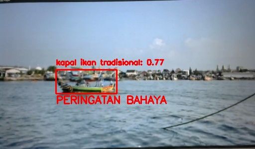
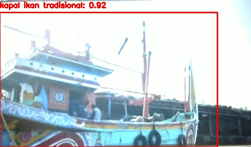
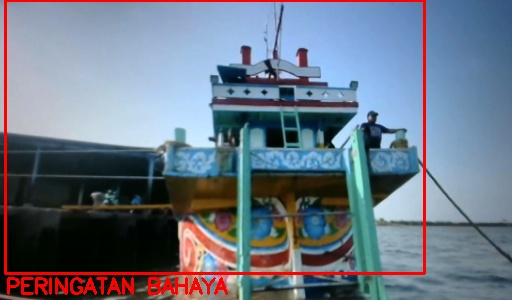
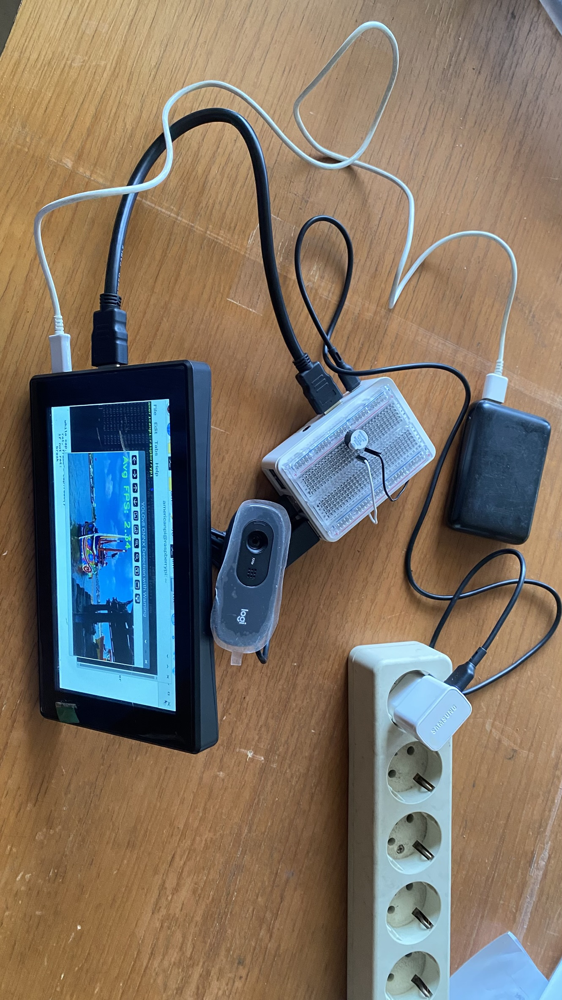
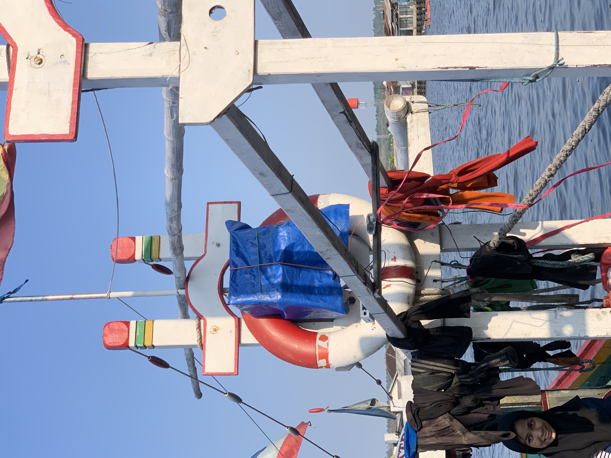

# 🚢 Automated Maritime Obstacle Detection System (YOLOv8 + ONNX)
AI-powered collision warning system for small-scale fishing vessels, optimized for real-time deployment on Raspberry Pi.


## 🎥 Demo
[On-board Test Video](assets/deployment/on_board_test.mp4)
[Watch Demo Video](https://youtu.be/OeMu7DTMnkM)

## 📸 Detection Preview




## 🚢 Real-World Deployment
This system was physically deployed and tested on a small-scale fishing vessel under real maritime conditions, validating its practical feasibility.





## 📌 Overview

This project presents a real-time obstacle detection system designed for small-scale maritime vessels (<30 GT). The system has been physically deployed and tested on a small fishing vessel to validate real-world performance. The system uses computer vision to detect nearby ships and trigger early warnings to reduce collision risk.

Built with efficiency in mind, the model is optimized for deployment on low-resource devices such as Raspberry Pi 3B+ using ONNX Runtime.

---

## ⚙️ Key Features

* 🎥 Real-time object detection (webcam & video input)
* 🚢 Detects multiple vessel types:

  * Cargo ships
  * Traditional fishing boats
  * Dredging vessels
  * Tugboats
* ⚠️ Intelligent danger warning based on object size (distance proxy)
* 💡 LED alert system (GPIO support for Raspberry Pi)
* 📸 Automatic capture of critical frames (lightweight alternative to video recording)
* 🧠 End-to-end pipeline: data scraping → training → ONNX deployment

## 📊 Results

- Achieved real-time detection on CPU (Raspberry Pi class device)
- Stable warning trigger based on object size thresholding
- Successfully detected multiple vessel types in dynamic conditions

---

## 🧠 System Workflow

```
Camera / Video Input
        ↓
YOLOv8 (ONNX Model)
        ↓
Object Detection
        ↓
Area-based Risk Analysis
        ↓
⚠️ Warning Trigger + Frame Capture
```

---

## 🏗️ Project Structure

```
obstacle-detection-system/
│
├── src/                # Main inference system
│   └── main.py
│
├── models/             # Trained model (ONNX)
│   └── best.onnx
│
├── training/           # Training & export pipeline
│   ├── train.py
│   ├── export_onnx.py
│   └── dataset_config/
│       ├── data.yaml
│       ├── dataset_notes.txt
│       └── roboflow_info.txt
│
├── dataset/            # Data scraping dari google
│   ├── scrap/
│   └── scrap.py
│
├── outputs/            # Captured detection results (ignored in Git)
│
├── requirements.txt
└── README.md
```

---

## 🚀 How to Run

### 1. Install Dependencies

```bash
pip install -r requirements.txt
```

---

### 2. Run Detection (Webcam)

```bash
python src/main.py --source webcam
```

---

### 3. Run Detection (Video File)

```bash
python src/main.py --source assets/test_video.mp4
```

---

## 🧪 Training the Model

Train using YOLOv8:

```bash
python training/train.py
```

Export to ONNX:

```bash
python training/export_onnx.py
```

---

## ⚡ Deployment Notes

* Optimized for **CPU-only inference**
* Designed to run on **Raspberry Pi 3B+**
* Uses **frame capture instead of video recording** to reduce computational load

---

## 📊 Technical Highlights

* YOLOv8-based object detection
* ONNX Runtime for lightweight inference
* Adaptive thresholding using bounding box area
* Hardware-aware optimization for edge devices

---

## ⚠️ Limitations

* Dataset not included due to size constraints
* Detection accuracy depends on dataset quality
* CPU inference may limit FPS on low-end devices

---

## 📌 Future Improvements

* Model quantization (INT8) for faster inference
* Distance estimation using monocular depth approximation
* Integration with alarm systems or onboard navigation tools

---

## 👤 Author

**Novalyina Ghassani Putri**
Naval Architecture Graduate | Data & Operations Enthusiast

---

## 💡 Notes

This project demonstrates an end-to-end machine learning pipeline, from data collection and model training to real-time deployment on edge devices. 
Dataset is not included due to size constraints.

---
